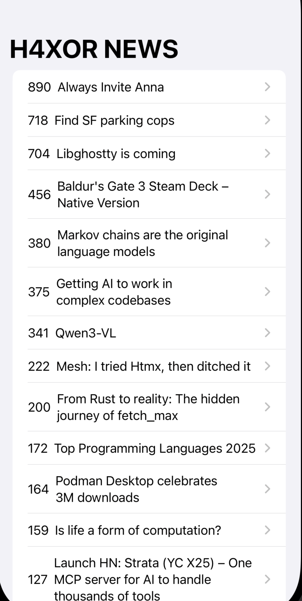

# 📰 Tech News App  

A simple iOS application built in **Swift** that fetches the latest tech news headlines from the **H4X0R News API (by Y Combinator)**.  
Users can browse tech related info and tap to open the full article in the app

---

## ✨ Features  
- 📰 **Live News Feed** — Fetches latest tech news via API  
- 📋 **Clean List UI** — Displays headlines in a simple table view  
- 🌐 **In-App Browsing** — Opens full articles in app   

---

## 📱 Screenshots  

  
  
  

  

---

## 🛠️ Technologies Used  
- **Swift**  
- **H4X0R News API**   
- **URLSession** for network requests  
- **JSON Parsing** in Swift  

---

